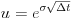

# The Binomial Options Pricing Model

An implementation of the binomial options pricing model, formalized by Cox, Ross and Rubinstein from the paper ["Option pricing: A simplified approach."](https://citeseerx.ist.psu.edu/viewdoc/download;jsessionid=99A50E0DAC1766A693E68CB029ADAE07?doi=10.1.1.379.7582&rep=rep1&type=pdf), for the valuation of American call and put options.

## Description

The binomial options pricing model traces the evolution of an options underlying financial instrument in discrete time, through the use of a binomial tree. Each node in the tree represents the value of the option and a possible price of the underlying instrument at a given point in time. The general structure of a binomial tree is given below:

Option valuation using this method is described as follows:

1. **Generation of binomial price tree**\
At each interval, it is assumed that the price of the underlying instrument, , will move up or down by a specific factor,  or , respectively. Therefore, the spot price, , of the underlying instrument at the  period can be calculated directly via . Where  represents the implied volatility of the underlying instrument,  represents the time duration of a step and  and  denote the number of times the price of the underlying instrument has moved up or down, respectively.

2. **Valuation of option at each final node**\
At each final node of the binomial tree (i.e. at expiration of the option), the option value is simply its intrinsic value:
- , for a call option.
- , for a put option.\
Where  is the strike price and  is the spot price of the underlying asset at the the  period.

3. **Sequential valuation of option at each preceding node**\

